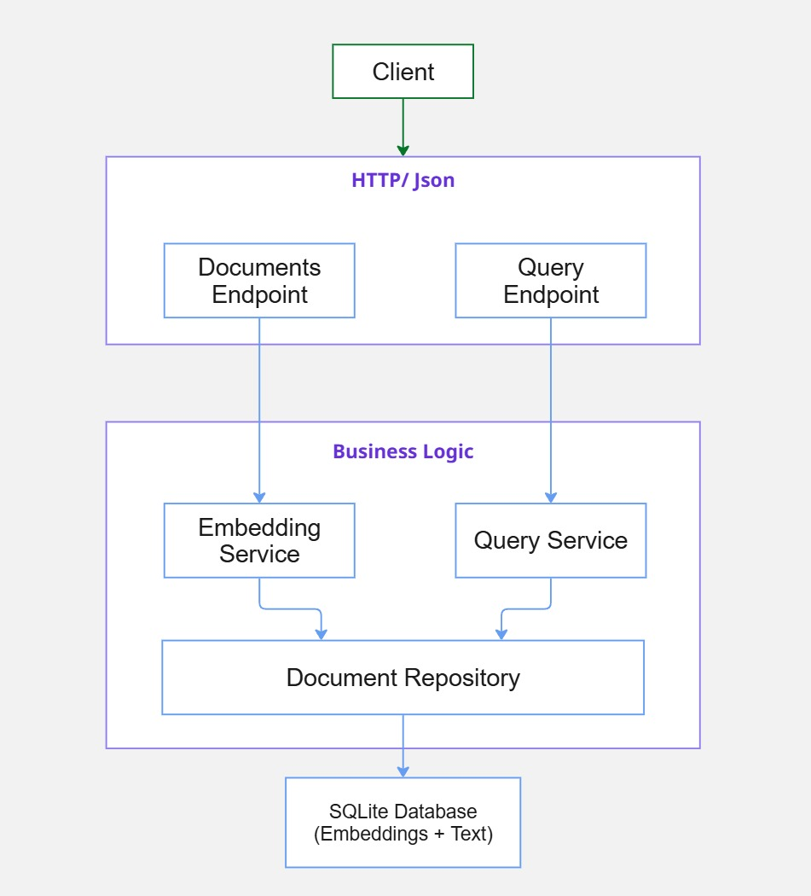

# SEMANTIC SEARCH API

## Overview

A high-performance **Semantic Search API** built with FastAPI that enables intelligent document retrieval using neural embeddings. Unlike traditional keyword-based search, this API understands the meaning and context of queries to find the most relevant documents.

### What is Semantic Search?

Semantic search uses machine learning models to convert text into numerical vectors (embeddings) that capture meaning. Documents with similar meanings have similar vectors, enabling search by concepts rather than just keywords.

**Example:**
- Query: "python programming"
- Matches: "Learn Python", "Python tutorial", "Programming with Python"
- Even without exact keyword matches, semantically related content is found

### Key Features

- 🔍 **Semantic Search**: Find documents by meaning, not just keywords
- 🚀 **Fast API**: Built with FastAPI for high performance and async support
- 📊 **Vector Embeddings**: Uses SentenceTransformers for state-of-the-art embeddings
- 💾 **SQLite Database**: Lightweight storage with SQLAlchemy ORM
- 📝 **Document Management**: Store and retrieve documents with metadata
- 🎯 **Similarity Ranking**: Results ordered by cosine similarity scores
- 🐳 **Docker Ready**: Complete containerization support
- ✅ **Fully Tested**: 54 tests with >80% code coverage

### Architecture



### API Endpoints

#### Documents
- `POST /api/v1/documents/` - Create multiple documents with embeddings
- `GET /api/v1/documents/` - List all stored documents
- `GET /api/v1/documents/{id}` - Retrieve a specific document

#### Search
- `GET /api/v1/query/?query=text&top_k=5` - Semantic search with ranked results

### Use Cases

- 📚 **Knowledge Base Search**: Find relevant documentation by meaning
- 🎓 **Educational Content**: Match learning materials to student questions
- 💼 **Enterprise Search**: Intelligent document retrieval in organizations
- 🛒 **Product Discovery**: Find products based on natural language descriptions
- 📰 **Content Recommendation**: Suggest similar articles or posts

## Installation

1. Clone the repository:
```bash
git clone https://github.com/seu-usuario/semantic-search-api.git
cd semantic-search-api
```

2. Install dependencies:
```bash
python -m pip install -r requirements.txt
```

## Running the Application

To start the development server:

```bash
python -m uvicorn app.main:app --reload
```

The application will be available at:
- API: `http://localhost:8000`
- Swagger Docs: `http://localhost:8000/docs`
- ReDoc: `http://localhost:8000/redoc`

You can use the PostMan Collection **[Postman Collection](postman/Semantic%20Search%20API.postman_collection.json)**

## Documentation

- **[Embedding Models](docs/embedding-models.md)** - Learn about available embedding models and how to configure them for your semantic search needs
- **[Docker Guide](docs/docker.md)** - Complete guide for running the application in Docker containers with environment variable configuration
- **[Testing Guide](docs/testing.md)** - Comprehensive guide for writing and running unit tests
